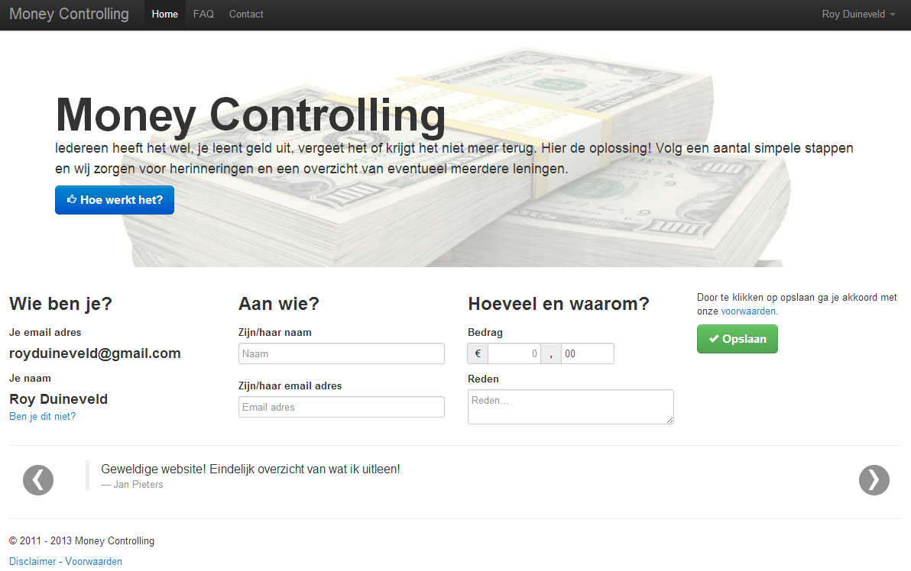

# Money Controlling

Back in 2011 I've created a Dutch platform to get lent money back: Money Controlling, formerly called Startcoin. The idea is simple; when you lend some money to friends you register it on the website. The website sends mails to your friends to inform them to get the money back. But first, they've to confirm it and you can mark loans as partly or fully paid. Until somewhere in 2016 the platform was online at moneycontrolling.com but nobody was using it so I've closed it. For more information see my Dutch blog post about the platform: https://royduineveld.nl/uitgeleend-geld-terug-krijgen/

## Why do you share this?

The project is abandoned by me, so maybe someone is interested in it. Fork it and build something great! I did my very best back than but when I look at it now, it's not that well written. But hey, everyone started somewhere right? And look at the Wordpress code, it can always be worse. You can find English comments almost everywhere in the code, so it's readable.

## Technical information

- It's build with the [CodeIgniter PHP framework](https://codeigniter.com/), version 2.1.0
- Frontend is based on [Bootstrap 2](http://getbootstrap.com/2.3.2/)

## Getting it up-and-running

- Check all variables in the config files in `public/application/config/`
- Import the database `database.sql`
- Make sure `short_open_tag` is enabled, see: http://php.net/manual/en/ini.core.php#ini.short-open-tag

## Questions? Bugs?

It's a old project so I'm not supporting it, but feel free to open a issue and lets see what I can do for you.

## License
[MIT](LICENSE.txt)
